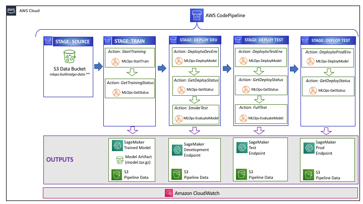
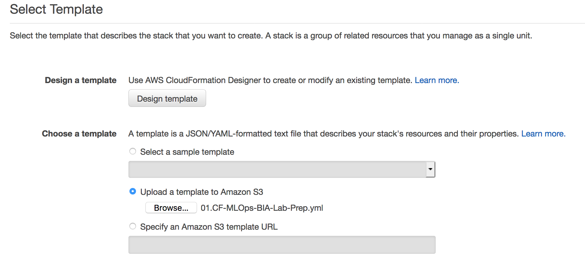
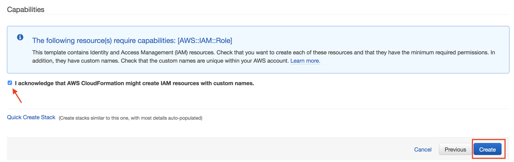
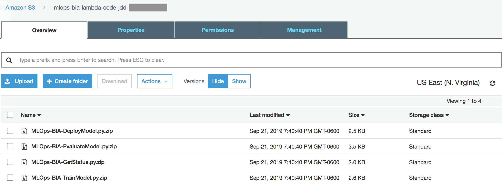
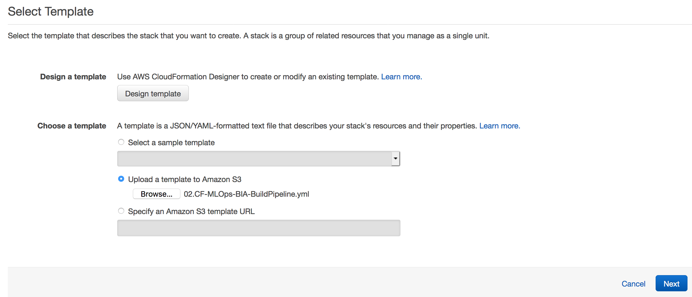
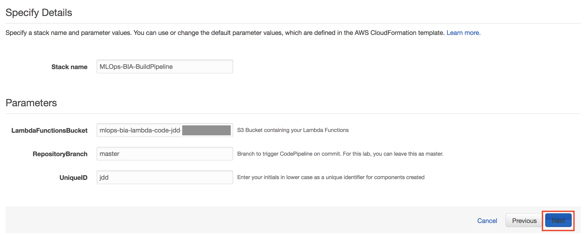
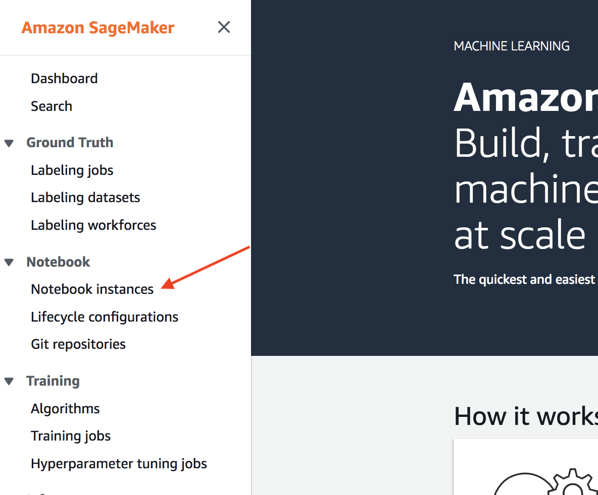
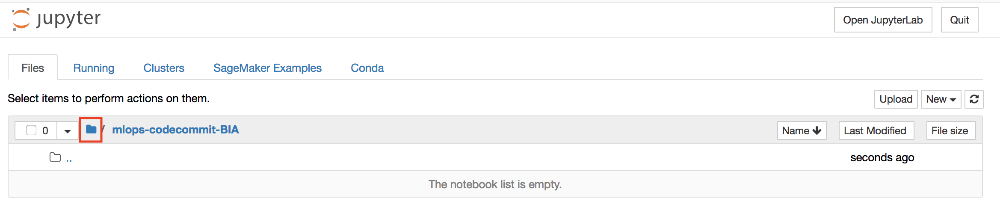
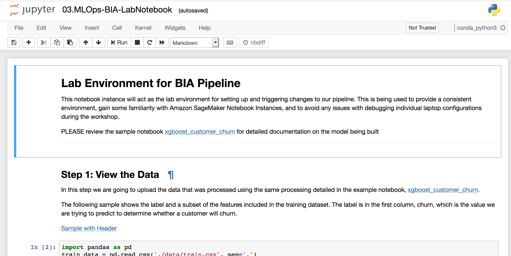

# 1. MLOps: Built-In-Algorithm

In this section of the workshop, we will focus on building a pipeline using a model trained using an Amazon SageMaker built-in algorithm, XGBoost.  For the purposes of this workshop, we will utilize an existing Amazon SageMaker example notebook, [xgboost_customer_churn](https://github.com/awslabs/amazon-sagemaker-examples/tree/master/introduction_to_applying_machine_learning/xgboost_customer_churn), in terms of the data and the model being built.   The dataset we use is publicly available and was mentioned in the book Discovering Knowledge in Data by Daniel T. Larose. It is attributed by the author to the University of California Irvine Repository of Machine Learning Datasets.

Take a few minutes to review the notebook to understand what we are going to build and deploy. 

This is a basic pipeline that can be used to retrain your model; however, additional capabilities should be considered when building a more robust pipeline that includes capabilitties such as:

 * aggregation & visualization of metrics   
 * cross-account deployments
 * fine grained controls on input and output artifacts of the pipeline
 * automatic clean-up & rollback
 * additional quality gates : manual or automatic 
 * source control integration for lambda functions used in pipeline activities
 * additional deployment options such as batch transform 
 * creation of [API via API Gateway](https://docs.aws.amazon.com/apigateway/latest/developerguide/how-to-create-api.html) to be used for hosting predictions

## Workshop Contents

For this portion of the workshop, we will be building the following pipeline:  

-------
## Prerequisite

1) AWS Account & Administrator Access
2) Please use North Virginia, **us-east-1** for this workshop

----
## Lab Overview

This lab will utilize a built-in SageMaker algorithm, [XGBoost](https://docs.aws.amazon.com/sagemaker/latest/dg/xgboost.html), to train a model and deploy it to various environments for validation using a pipeline created in [AWS CodePipeline](https://aws.amazon.com/codepipeline/).  The pipeline will be setup to trigger based on new training data and/or manual execution of the pipeline. 

--------
## Step 1: Workshop Preparation

First, we will execute a Cloud Formation template to do some initial setup of our environment including creating: 

* **[AWS CodeCommit](https://aws.amazon.com/codecommit/) Repositories:** AWS CodeCommit repositories that will store our:

     - **Training Config:** configuration code used for training the model (ex. hyperparameters)
    - **Pipeline Lambda Code:** code that we will use for training and deploying our model using Amazon SageMaker
    - **Inference Lambda Code:** code that we will use for evaluation of the model by running predictions against our hosted model 
    *Note: These repositories could be created in GitHub as an alternative to AWS CodeCommit* 

 * **S3 Bucket for [Lambda Functions:](https://aws.amazon.com/lambda/)** 

    - **Lambda Pipeline Functions:** Lambda function code that will be used in a later step to build an end-to-end ML pipeline within CodePipeline 

* **[SageMaker Notebook Instance:](https://docs.aws.amazon.com/sagemaker/latest/dg/nbi.html)** This notebook instance will be used as our lab environment after our initial setups required for setting up the lab/pipeline.  We are utilizing a notebook instance instead fo a local environment to ensure a consistent lab environment.  

* **[SageMaker Notebook lifecycle configuration:](https://docs.aws.amazon.com/sagemaker/latest/dg/notebook-lifecycle-config.html)** Lifecycle configuration created to automatically clone this workshop repository including the notebook instance included for this workshop. 

  

### Steps:

To launch the setup of the resources above using CloudFormation:

1) Download this git repository by either cloning the repository or downloading the *zip

2) Login to the [AWS Console](https://https://console.aws.amazon.com/) and enter your credentials

3) Under **Services**, select [CloudFormation](https://console.aws.amazon.com/cloudformation)

4) Click **Create Stack** buttton,  then click **Next**

5) Under **Select Template**:
    * Click radio button next to 'Upload a template to Amazon S3', then click **Browse...**

    * From the local repository cloned to your machine in step 1, select the file called ./1-Built-In-Algorithm/01.CF-MLOps-BIA-Lab-Prep.yml

    * Click **Open**

    

6) Under **Stack Details** specify: 

     * **Stack Name**: Recognizable name such as 'MLOps-BIA-WorkshopSetup'

     *  **UniqueID**: Enter *yourinitials* in lower case only [Example: jdd]

7) Click **Next** 

8) Under **Configure stack options**, leave all defaults and click **Next**

9) Under **Review**, scroll to the bottom and check the checkbox acknowledging that CloudFormation might create IAM resources and custom names, then click **Create**

10) You will be returned to the CloudFormation console and will see your stack status **CREATE_IN_PROGRESS**

11) After a few mimutes, you should see your stack Status change to **CREATE_COMPLETE**.  You're encouraged to go explore the resources noted above that are created as part of this initial setup. 

--------
## Step 2: Lambda Function Upload 

In this step, you will need to upload pre-packaged Lambda functions to S3. These Lambda functions will be used at various stages in our MLOps pipeline. Because we will be using CloudFormation and the [AWS Serverless Application Model (SAM)](https://aws.amazon.com/serverless/sam/) to deploy the Lambda functions into our accounts, they must be packaged and uploaded to S3 prior to executing our next CloudFormation template.

**Steps:**

1. From the AWS Console, click on **Services**, then choose **S3** on the top menu.  

2. Find and click on your bucket created in the previous step (mlops-**bia**-lambda-code-*yourinitials-randomid*) 

    **WARNING:** If you are doing both workshops, make sure you choose the correct bucket above by ensuring it has **bia** in the naming

3. In the upper left hand corner, click **Upload**

4. Click **Add Files**, upload the following files from your local machine that were provided as part of the class lab materials and cloned from the repository in the [**/lambda-code**](./lambda-code) folder:

   - **MLOps-BIA-TrainModel.py.zip:**  This Lambda function is responsible for executing a function that will accept various user parameters from code pipeline as input including: SageMaker Built-In Algorithm Name, Training Compute, Instance Volume Size, and [XGBoost Hyperparameters](https://docs.aws.amazon.com/sagemaker/latest/dg/xgboost_hyperparameters.html).  That information will be used along with environment variables setup to create a SageMaker training job and train a model using SageMaker

   - **MLOps-BIA-GetStatus.py.zip:** This Lambda function is responsible for checking the status of the previous Lambda function.  Because Lambda has an execution time limit, this function ensures that the status of the previous function is accurately captured before moving on to the next stage in the pipeline

   - **MLOps-BIA-DeployModel.py.zip:** This Lambda function is responsible for executing a function that will accept user parameters from CodePipeline including: Hosting Instance Type, Hosting Instance, Hosting Instance Code, Variant Weight, Endpoint Configuration Name (ex. Dev / Test / Prod). That information is used to setup a Configuration Endpoint and Endpoint for hosting the trained model using SageMaker

    - **MLOps-BIA-EvaluateModel.py.zip:** This Lambda function is responsible for running predictions against the trained model by accepting an environment identifier as well as an S3 bucket with sample payload as input from code pipeline.  

5. After selecting the files above from your local system, click **Next**

6. For (2) Set Permissions & (3) Set Properties,  accept default values and click **Next**

7. For (4) Review, review the settings and click ‘**Upload**

8. Validate that you now see all files successfully uploaded to your S3 bucket, then continue to the next step.

    

--------
## Step 3: Create Pipeline Environment

In this step, you will execute a CloudFormation template using the file 02.CF-MLOps-BIA-BuildPipeline.yml provided as part of workshop materials. This CloudFormation template accepts input parameters that will be used to setup base components of our CI/CD pipeline including: 

*  **IAM Roles:**

   -	**Lambda Execution Role:** This role will be utilized by all of the Lambda functions created in this lab.  The role provides access to AWS services accessed by the Lambda functions including S3, SageMaker, CloudWatch, and CodePipeline.

   -	**CodePipelineRole:** This role will be utilized by CodePipeline to setup a trusted relationship between CodePipeline and AWS resource utilized in setting up the pipeline.

   *NOTE: The roles setup in this lab include FullAccess policies for AWS services to avoid complexities and issues in different lab environments.  Best practice includes refining the policies attached to these roles to ensure fine grained access/authorization on specific resources*

*  **Lambda Functions:**

    -	Lambda functions utilizing the packaged code uploaded to S3 in the above step.  The Lambda function definitions include the code packaged above as well as specifications related to the Lambda function runtime, configuration, and environment variables. 

*  **CodePipeline Pipeline**

    - 	Set up a CodePipeline that utilizes resources built in the CloudFormation template to create and end-to-end pipeline that we will use to build,train,and deploy mode to target environments

*  **S3 Data Bucket** 
    - **Training & Validation Data:** For this workshop we are making the assumption that there is an analytics pipeline sitting in front of our ML pipeline that performs the necessary data transformations and engineering as discovered during data science development lifecycles. This bucket will have versioning enabled.

*  **S3 CodePipeline Bucket** 
    -S3 bucket that will be used to log codepipeline information across the actions in the pipeline

* **S3 Artifact Bucket** 
    -S3 bucket that is versioned and will contained the trained model

**Steps:**

To launch the setup of the resources above using CloudFormation:

1) Login to the [AWS Console](https://https://console.aws.amazon.com/) and enter your credentials

2) Under **Services**, select [CloudFormation](https://console.aws.amazon.com/cloudformation)

3) Click **Create Stack** buttton

4) Under **Select Template**:
    * Click radio button next to 'Upload a template to Amazon S3', then click **Browse...**

    * From the local repository cloned to your machine in step 1, select the file called ./1-Built-In-Algorithm/02.CF-MLOps-BIA-BuildPipeline.yml

    * Click **Open**

     

5)  Click **Next**

6)  Under **Specify stack details:**

     *	**Stack name:** MLOps-BIA-BuildPipeline
 
7) Under **Parameters** this is where we will specify input parameters that will be used by CloudFormation when building out resources.
   
   * **LambdaFunctionsBucket:** Enter the name of the existing S3 bucket that contains the lambda code we uploaded in the previous step
 (i.e. mlops-**bia**-lambda-code-yourinitials-uniqueid)

   * **RepositoryBranch:** master

   * **UniqueID:** Enter your initials in lower case (Example: jdd)
  
  

8) Click **Next**

9) Under **Configure stack options:**

   * Accept all defaults and click **Next**

10)	Review your settings, scroll down and click the checkbox at the bottom of the screen agknowledging that you want CloudFormation to create the IAM roles identified in the CloudFormation template.  Click **Create**.

11) You will be returned to the CloudFormation console and will see your stack status **'CREATE_IN_PROGRESS'**

12) After a few minutes, you will see your stack Status change to **'CREATE_COMPLETE'**. You're encouraged to go explore the resources created as part of this initial setup.

---
## Step 4: Trigger Pipeline Executions

In this step, you will execute activities within a SageMaker Notebook Instance to:
   
   1. **Simulate Analytics Pipeline Activities**: Push S3 training and validation data to the S3 data bucket (i.e. mlops-data-*yourinitials-uniqueid*)
   
### Steps:

1. Login to the [AWS Console](https://https://console.aws.amazon.com/) and enter your credentials

2. Select **Services** from the top menu, and choose **Amazon SageMaker** 

3. Click on **Notebook Instances**

4. You should see a notebook instance, created by the CloudFormation template, called **MLOps-BIA-Notebook-***.  Click **Open Jupyter**

5. Under the **Files** tab, you will see a folder called **MLOps-codecommit-byo** and a root folder:

   * Click on the root folder

   

   * Within that folder is a notebook we will be using for the remainder of the workshop called **03.MLOps-BIA-LabNotebook.ipynb**.  

6. Click on the **03.MLOps-BIA-LabNotebook.ipynb** notebook, and it will bring you into your Jupyter Notebook instance environment.  

The remainder of the workshop will be conducted inside the Jupyter Notebook instance.  If you are not familiar with working inside notebook instance environments, the main items you will need to know for this workshop are below: 

   * To execute the current code cell, you can click **Run** on the top menu or Shift + Enter

   * **IMPORTANT:  EXECUTE THE CELLS IN ORDER, WAITING FOR THE PREVIOUS TO SUCCESSFULLY COMPLETE BEFORE EXECUTING THE NEXT**.   A cell has completed execution when there is a number in the bracked next to the cell as shown below.   If the cell is still executing, you will see [*]

---

## Step 6: Clean-Up

In addition to the steps for clean-up noted in your notebook instance, please execute the following clean-up steps.  Note: These steps can be automated and/or done programmatically but doing manual clean to enforce what was created during the workshop. 

1. Login to the [AWS Console](https://https://console.aws.amazon.com/) and enter your credentials   

2. Select **Services** from the top menu, and choose **Amazon SageMaker**

   **Notebook Instance**
   * Go to **Notebook Instances** on the left hand menu, select your notebook instance by selecting the radio button next to it.

   *  Select **Actions** and then **Stop** from the dropdown list

   **Endpoints**
   * Go to **Inference / Endpoints** on the left hand menu, click the radio button next to each endpoint. 

   * Select **Actions** and then **Delete**, then confirm delete hitting the **Delete** button. 

3. Select **Services** from the top menu, and choose **S3**

    * Delete all S3 buckets created for this workshop with the following naming convention: 
      - mlops-bia-*
    
    * Click the box next to each bucket and click **Delete** -> confirm deletion
       
       

4. Select **Services** from the top menu, and choose **CloudFormation**

   * For the two stacks that were created in this workshop (MLOps-*), click the checkbox next to the stack.  Select **Actions** , then **Delete Stack**
