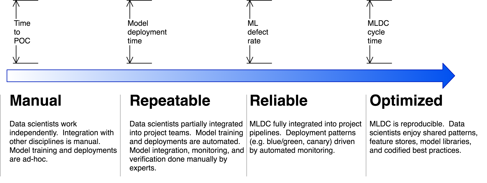
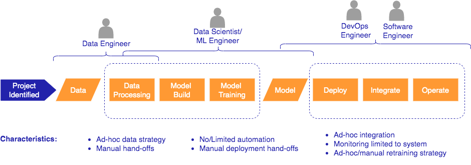
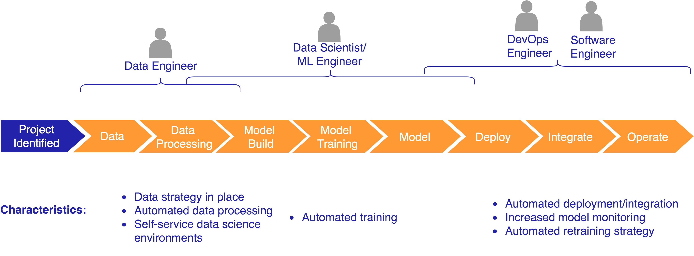
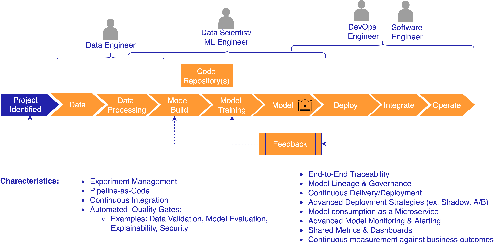
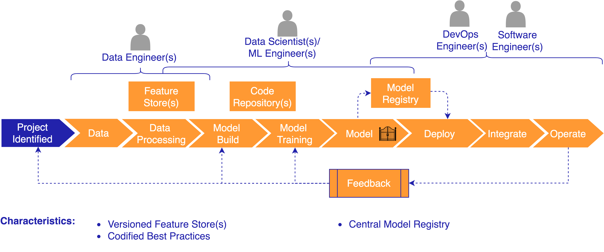

# Amazon SageMaker MLOps

The labs contained in this repository are focused on applying MLOps practices to Machine Learning(ML) workloads using Amazon SageMaker as the underlying service for model development, training, and hosting.  The repository is organized by breaking out standard practices based on stages of adoption in ML workloads.

 

## Background 

MLOps refers to a methodology that is built on applying [DevOps practices](https://aws.amazon.com/devops/what-is-devops/) to machine
learning workloads. DevOps focuses on the intersection of development and operations disciplines to streamline software delivery across the Software Development Lifecycle(SDLC). MLOps focuses on the intersection of data science, data engineering in combination with existing DevOps practices to streamline model delivery across the Machine Learning Development Lifecycle (MLDC). 

MLOps is the discipline of integrating ML workloads into release management, CI/CD, and operations. At many companies, ML projects start with data scientists operating within research teams that are isolated from other teams. As ML projects prove their value with initial proof-of-concept results, companies naturally want to move them into
production. Just as DevOps integrates software development and operations, MLOps requires the integration of software development, operations, security, data engineering, and data science.

## Objective

The goal in applying MLOps practices to ML workloads is to enable customers to accelerate the adoption of ML workloads and optimize operational aspects of building, deploying, and operating ML workloads.  There are a set of practices and characteristics we see adopted as customers move from the manual stages typical with initial projects to being able to adopt ML workloads at scale.

Let's look at each stage of adoption at a high level... 

**Manual** 

The Manual stage is where we typically see customers beginning to incorporate ML projects into their overall strategy to drive business outcomes.  At this stage, the MLDC typically involves a lot of manual hand-offs and processes.

   
Technical Focus: 

   * Team education (Machine Learning, AWS Services)
   * Building a model that provides business value
   * Ability to collaborate and share assets
   * Focus on core capabilities of building, training, and deploying a model

Getting Started Resources:

 * [SageMaker Examples](https://github.com/aws/amazon-sagemaker-examples)

**Repeatable** 

The Repeatable stage is where we see customers beginning to increase the number of ML models they are building and need to deploy as well as manage in production environments.  At this stage, the focus is on automating pipelines required to provide a repeatable mechanism to deploy to target environments.  

   
Technical Focus: 

   * Automating data, training, and deployment pipelines. 
   * Reducing the number of manual hand-offs
   * Working collaborative across cross-functional teams including necessary stakeholders (ex. Security, Compliance)

Resources/Labs: 

* Automated workflows using the [AWS Step Functions Data Science Python SDK](https://docs.aws.amazon.com/step-functions/latest/dg/concepts-python-sdk.html)
  
  * [Hands-on Examples](https://github.com/aws/amazon-sagemaker-examples/tree/master/step-functions-data-science-sdk)

* Self Service Governed [Data Science Sandbox Environments](https://aws.amazon.com/blogs/mt/enable-self-service-secured-data-science-using-amazon-sagemaker-notebooks-and-aws-service-catalog/)

**Reliable** 

The Reliable stage is where we see customers beginning to apply more mature practices such as CI/CD and metric based retraining strategies to ML workloads.  While the Repeatable stages focuses on applying automation to your pipelines, the Reliable stages builds on that level by starting to adopt more mature MLOps practices into your  pipelines. 

   
Technical Focus: 

   * Integrating higher level MLOps practices  such as CI/CD with:

     * Source/Version Control for infrastructure (Infrastructure-as-Code), configuration (Configuration-as-Code), machine learning code, inference code, data, and packaged libraries/artifacts
     
     * End-to-end traceability (i.e. pipeline 
    traceability, model lineage, data lineage)

     * Automated quality gates

     * Continuous monitoring for impact to  business outcomes,  model monitoring (ex. Data/Concept Drift, Latency), and system monitoring

     * Built in feedback loops for model performance and retraining activities. 

     * Building flexible pipelines supporting advanced deployment scenarios such as A/B Testing, Inference Pipeline and Multi-Model Endpoints

     * Automating the creation of APIs for consumption
     * Implementing governed self-service environments for experimentation and development  

Resources/Labs:

*Solutions:*

* [AWS MLOps Framework Solution](https://aws.amazon.com/solutions/implementations/aws-mlops-framework/): This is a one-click to deploy solution published in the *AWS Solutions Library*  that creates a pre-configured pipeline. 

*Labs/Workshops:*
* [Built-In-Algorithm - Simple Pipeline](/1-Built-In-Algorithm/README.md): Simple pipeline to train and deploy a model built using SageMaker's XGBoost built-in-algorithm along with CodePipeline, CloudFormation, StepFunctions & Lambda. 
* [Built-In-Algorithm - Cross Account](/3-Built-In-Algorithm-Cross-Account/README.md): Cross account pipeline to train and deploy a model built using SageMaker's XGBoost built-in-algorithm along with CodePipeline & Lambda. 
* [Bring-Your-Own-Algorithm - Simple Pipeline](/2-Bring-Your-Own/README.md): Simple pipeline to build a SageMaker compatible docker image, then train and deploy a model built using scikit along with CodePipeline, CodeBuild, CloudFormation, StepFunctions & Lambda. 
* [Built-In-Algorithm - Jenkins Pipeline](/4-Built-In-Algorithm-Jenkins/README.md): Simple Jenkins pipeline to train and deploy a model built using SageMaker's XGBoost built-in-algorithm.
* [Built-In-Algorithm - Advanced Blue/Green Deployment Pipeline](https://github.com/aws-samples/amazon-sagemaker-safe-deployment-pipeline): Pipeline using SageMaker features such as Experiments & Model Monitor as well as building a pipeline to train and deploy a model built using SageMaker's XGBoost built-in-algorithm. 

**Optimized** 

The Optimized stage is where we see customers adopting practices and mechanisms that allow for scaling machine learning projects across teams/organizations. At this stage, the MLDC becomes increasingly reproducible.   

*Labs/Workshops:*

**COMING SOON** 

## License

This library is licensed under the Apache 2.0 License. 
