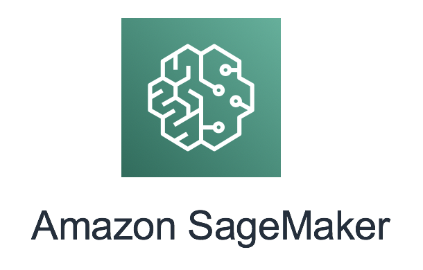

# Amazon SageMaker MLOps

The workshops contained in this repository are focused on demonstrating capabilities around MLOps - applying core DevOps practices to Machine Learning workloads using [AWS Developer Tools](https://aws.amazon.com/products/developer-tools/) combined with [Amazon SageMaker](https://aws.amazon.com/sagemaker/).  

## Background 
Applying DevOps practices to Machine Learning (ML) workloads is a fundamental practice to ensure models are deployed using a reliable and consistent process as well as establishing a strategy for retraining your models.

DevOps is not about automating the deployment of a model.  It is about applying practices such as Continuous Integration(CI) and Continuous Delivery(CD) to the development lifecycle.  These practices rely on automation to achieve CI/CD but applying automation alone is not synonymous with CI/CD.  In this lab, you will create a deployment pipeline utilizing AWS Development Services and SageMaker to demonstrate how CI/CD can be applied to machine learning workloads.  There is no one-size-fits-all model for creating a pipeline; however, the same general concepts explored in this workshop can be applied across various services/tooling to meet the same end result. 

## Core Tenets

* **Versioning:** For Machine Learning workloads versioning of artifacts includes standard best practices around versioning of code and containers but also includes versioning of data, algorithms, and model artifacts. 

* **Quality Gates:** Ensuring a minimum degree of model quality before introducing a model into production.  This can include gates across multiple components measuring the readiness to move to a target environment such as:  model evaluation, system monitoring, and business impact evaluation. 

* **Automated Deployment:** Automated deployments of your model for predictions ensures consistency and reliability.

* **Automatic Retraining:** Automated retraining, based on the strategy defined for your model, is key in being able to prevent model drift and take advantage of new ground truth data.

## Workshop Contents

This repository demonstrates the following use cases covering reference pipelines for common scenarios.   These are reference pipelines only and should be adjusted for specific use cases. 

* **[Reference Pipeline #1:](/1-Built-In-Algorithm/README.md)** Pipeline using Amazon SageMaker built-in algorithm 

* **[Reference Pipeline #2:](/2-Bring-Your-Own/README.md)** Pipeline using Amazon Sagemaker and bring-your-own algorithm

* **[Reference Pipeline #3:](/3-Built-In-Algorithm-Cross-Acccount/README.md)** Cross Account Pipeline using Amazon Sagemaker and built-in algorithm

* **[Reference Pipeline #4:](/4-Built-In-Algorithm-Jenkins/README.md)** Pipeline using Jenkins with Amazon SageMaker built-in algorithm

## Other Resources

The following workshops/code samples also provide patterns for implementing MLOps practices on AWS: 

* **Amazon SageMaker Safe Deployment Pipeline**: [Pipeline](https://github.com/aws-samples/amazon-sagemaker-safe-deployment-pipeline) showcasing safe deployments using A/B testing with consumable API 

## License

This library is licensed under the Apache 2.0 License. 
