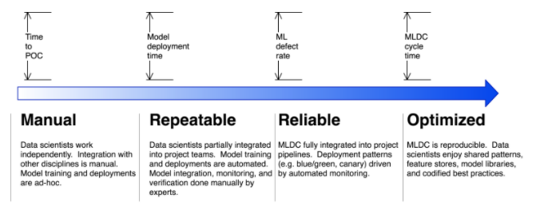

# MLOps Lab 1

## Lab Introduction

This Lab covers core Amazon SageMaker components and how they help our customers 
to transition their model's journey experimentation to production, through the development of 
MLOps foundations.

We typically see this journey/adoption broken up into four stages:

Each stage represents practices that align to the increased adoption of MLOps practices to move from an initial or repeatable stage to adopting ML workloads at scale.

This lab will cover the Initial and Repeatable stages. Often customers will span multiple stages as they begin to adopt practices that are common within each stage.

In the Initial stage, you begin to incorporate ML projects into your overall strategy to drive business outcomes. At this stage, the Machine Learning Development Cycle (MLDC) typically involves a lot of manual hand-offs and processes. For example, the data engineer manually hands off the data to the data scientists. The data scientists manually hand off their model to the deployment team which can consist of DevOps or MLOps engineers.

In this Initial stage, you might have or will have multiple models running in production with manual handoffs and processes and that starts to become very cumbersome. So there becomes a need to increase the level of automation to ensure the deployments are repeatable. This is where we move to the Repeatable stage where we automate most handoffs by orchestrating each step of the MLDC together.

In the Repeatable stage, customers focus on automation, relying on lessons learned from DevOps. Data scientists, Data Engineers, and DevOps Engineers work to automate model training and deployment as well as reduce manual hand-offs between steps. That automation reduces manual errors and increases MLDC velocity.

In the Reliable stage, customers shift focus to improving quality. The quality checks that data scientists often perform manually, like checking for data drift and evaluating model metrics, are built into the MLDC pipeline. That requires putting ML monitoring tools into place, and lets the pipelines use best-of-breed patterns like blue/green upgrades. At this stage, CI/CD practices such as source and version control along with automated quality gates are implemented. Defect rates begin to drop.

Finally, as ML becomes a widespread and valuable practice in the organization, customers reach the Scalable stage. At the Scalable phase, customers see ML become widely impactful across the organization. The MLDC cycle time drops as cross-functional ML teams become more productive. Data scientists enjoy the benefits of codified best practices and shared model and feature repositories, which take time and effort to collect but often don’t directly benefit a specific team. At this stage, mechanisms are established for sharing practices and assets across the organization. This stage is as much about people and process as about technology, and customers often see data scientists assigned directly to project teams or rotating from the Center of Excellence (CoE) into other business units.

## Setting up the Lab environment
Go ahead and start the workshop by opening up the `1-data-prep-feature-store.ipynb` notebook!
