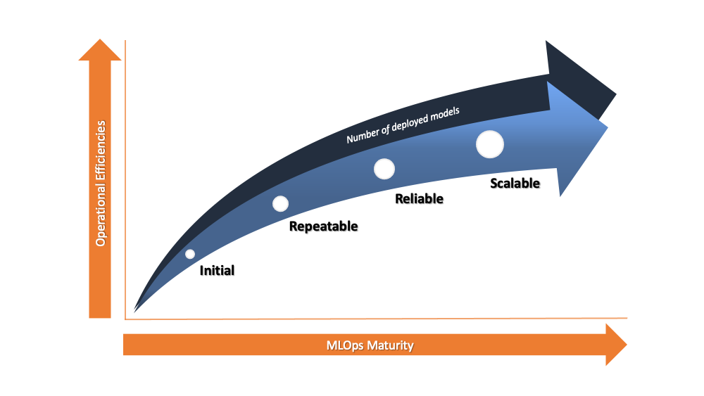

# Scaling MLOps Workshop

This workshop goes through a common customer journey when beginning and maturing your MLOps journey from Initial to Scalable.  

## Lab Introduction

Please refer to the following link for detailed workshop guidance: [SageMaker MLOps Workshop](https://bit.ly/40txRE6)

## Additional Resources

* Check this [Blog Post](https://aws.amazon.com/blogs/machine-learning/mlops-foundation-roadmap-for-enterprises-with-amazon-sagemaker/)
for further details on the MLOps Foundations Roadmap for Enterprises on Amazon SageMaker.

* [SageMaker MLOps Custom Project Templates GitHub Repository](https://github.com/aws-samples/sagemaker-custom-project-templates): This repository contains example projects templates based on common customer patterns. 
